  
  
  

  

---

## ☕ Lunex Tech

**FROM IDEA TO IMPACT.** Lunex Tech builds web apps and AI products. Founded by Kaushik, with HITHOZHA as a sister project.

Every page I build aims to be fast, accessible, and a little bit fun to use.

## 🐍 My contribution snake

  <picture>
    <source media="(prefers-color-scheme: dark)" srcset="dist/github-contribution-grid-snake-dark.svg" />
    
  </picture>

---

## 🧰 Tech stack

  

Working with OpenAI, Gemini, Claude APIs, and React Native + Capacitor for mobile.

---

## 📊 GitHub stats

  
  

  

  

---

## 📌 Featured projects

| Project | What it does |
| --- | --- |
| [hackathon-management-system](https://github.com/kaushikbuilds-cloud/hackathon-management-system) | Manages hackathon events end to end |
| [Lunex Tech](https://github.com/kaushikbuilds-cloud) | Founder company, building web and AI products |
| [HITHOZHA](https://github.com/kaushikbuilds-cloud) | Founder project |

---

### 📬 Let's connect

